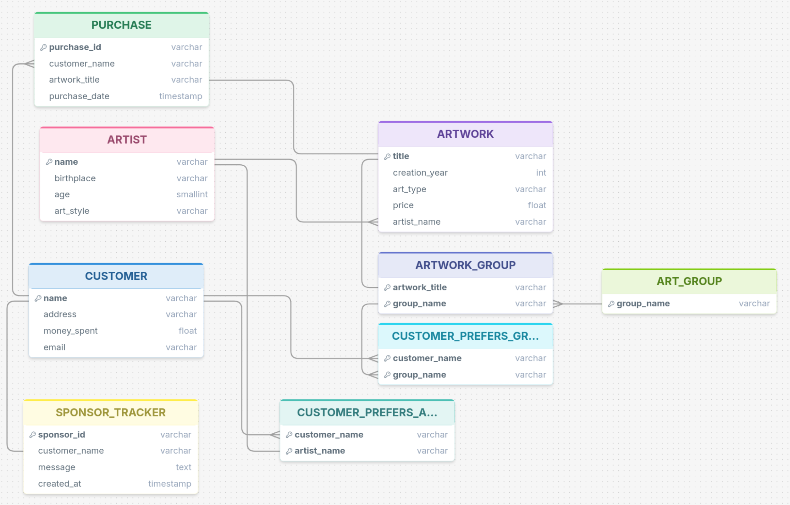

# Databases-Project-Spring-2026-
This project implements the ComicDom 2026 festival database using PostgreSQL, including relational schema design, advanced SQL queries, triggers and procedural SQL logic.

